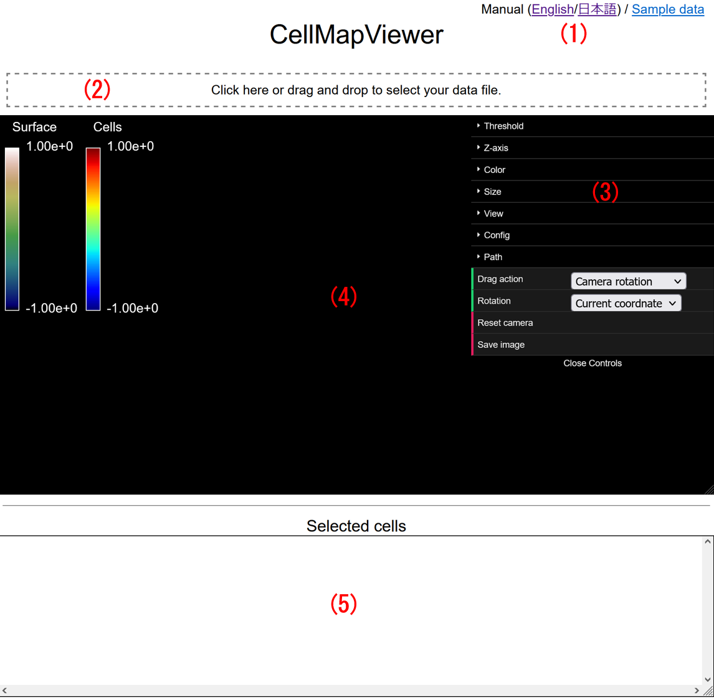
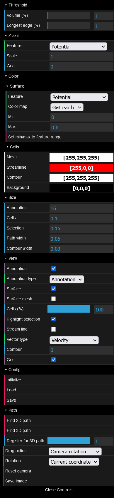
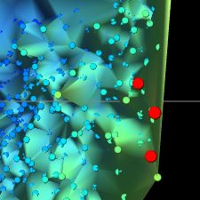
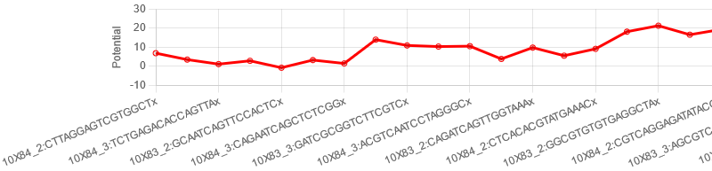

# CellMap Viewer
CellMap Viewer is a Web application for 3D-visualization of a cell map (cell differentiation landscape). It reads cell data including coordinates and features from a CSV-formatted text file, computes Delaunay triangulations, and displays the result.

<a href="https://yusuke-imoto-lab.github.io/CellMapViewer/CellMapViewer/viewer.html" target="_blank">Run CellMapViewer</a>

* Sample dataset is available [here](https://www.dropbox.com/s/aqjrpeos4auvycy/CellMap_hippocampus.csv?dl=1). 
* Imput data creation is available [here](https://github.com/yusuke-imoto-lab/CellMap). 

<h1>Manual</h1>

Last updated: August 26th, 2022

<a href="https://yusuke-imoto-lab.github.io/CellMapViewer/CellMapViewer/manual_ja.html">Japanese</a>

<h2>Table of contents</h2>
<ul>
    <li><a href="#overview">Overview</a></li>
    <li><a href="#user-interface">User interface</a></li>
    <li><a href="#input-file-format">Input file format</a></li>
    <li><a href="#how-to-visualize">Visualizing your cell map data</a></li>
    <li><a href="#how-to-read">Reading a cell map</a></li>
    <li><a href="#algorithm">Algorithm for visualization</a></li>
    <li><a href="#configuration">Configuring visualization</a></li>
    <li><a href="#control-viewpoint">Controlling the viewpoint</a></li>
    <li><a href="#selecting-cells">Selecting cells</a></li>
    <li><a href="#finding-path">Finding a path</a></li>
    <li><a href="#screenshot">Taking a screenshot</a></li>
</ul>

<h2 id="overview">Overview</h2>

CellMapViewer is a Web application for 3D-visualization of a cell map. It reads cell data including coordinates and features from a CSV-formatted text file, computes Delaunay triangulations, and displays the result.

Once displayed, you can:

<ul>
    <li>control the viewpoint with the mouse;</li>
    <li>select cells with the mouse;</li>
    <li>find the shortest path between two points, and draw chart for feature values on the path;</li>
    <li>save a screenshot in PNG format;</li>
    <li>save data of selected cells as a CSV-formatted text file; and</li>
    <li>save and load the configure file.</li>
</ul>

In addition, via the GUI menu, you can configure:

<ul>
    <li>triangles to remove from the triangulation;</li>
    <li>the <em>z</em> axis feature;</li>
    <li>the coloring of the surface/cells and the background;</li>
    <li>the cell point size and the path width;</li>
    <li>the visibility of the annotations, of the surface, of the cell points, and of the grid; and</li>
    <li>whether to highlight the selected cells.</li>
</ul>

Furthermore, it automatically shows the information of the selected cells, including the coordinates and the features, as well as statistics such as mean.

<h2 id="user-interface">User interface</h2>

<h3 id="links-to-manuals">(1) Links to the manuals and sample data</h3>

English- and Japanese-versions are available.

<h3 id="file-selection-area">(2) File selection area</h3>

When clicked, the file dialog is shown to select the input file. You can also drag and drop the input file here. When visualizing data, the file name is shown above this area.

<h3 id="menu">(3) Menu</h3>

The menu for configurations and operations. For details, see <a href="#configuration">"Configuring visualization"</a> for [Threshold], [Z-axis], [Color], [Size], [View], [Config] and [Drag action], <a href="#control-viewpoint">"Controlling the viewpoint"</a> for [Reset camera], <a href="#finding-path">"Finding a path"</a> for [Finding 2D (3D) path], and <a href="#screenshot">"Taking a screenshot"</a> for [Save image]. The menu can be closed (opened) by clicking [Close (Open) Controls].

<h3 id="map-displayed-area">(4) Cell map-displayed area</h3>

Can be controlled with the mouse. The height can be adjusted by dragging the right-bottom corner (not supported in Safari) or the horizontal line below. See <a href="#control-viewpoint">"Controlling the viewpoint"</a> for details.

<h3 id="selected-cell-information">(5) Selected-cell information</h3>

Displays the information and the statistics of the selected cells. The height can be adjusted by dragging the right-bottom corner. See <a href="#showing-of-information">"Showing of the selected cells' information"</a> for details. Clicking on the number of cells, displayed on the right of "Selected cells", saves the contents of the table in CSV format.

<h2 id="input-file-format">Input file format</h2>

The input file must:

<ul>
    <li>be a text file;</li>
    <li>be encoded in UTF-8;</li>
    <li>be CSV-formatted using comma (",") as a delimiter;</li>
    <li>have the header describing the column names as the first line;</li>
    <li>have no redundancy in the column names;/li>
    <li>describe each single cell data in each single line below the first one;</li>
    <li>contain "CellID", "X", "Y" and "Potential" columns (the characters' case and the presence of white spaces do not matter);</li>
    <li>have lines with the equal number of columns; and</li>
    <li>have finite numbers in the columns interpreted as numbers (see <a href="#columns">"Columns"</a>).</li>
</ul>

If these requirements are not satisfied, the file will cause errors, be read incorrectly or be garbled. Empty lines and lines containing only whitespace characters are skipped.

<h3 id="columns">Columns</h3>

Columns are interpreted depending on their names as follows.

<ul>
    <li>"CellID": Cell name</li>
    <li>"X": <em>x</em> coordinate (number)</li>
    <li>"Y": <em>y</em> coordinate (number)</li>
    <li>"Potential": Cell potential (number, <em>z</em> coordinate candidate)</li>
    <li>"Annotation": Cell type</li>
    <li>Other name: Feature for <em>z</em> coordinate candidate (number)</li>
</ul>

Column names are interpreted regardless of the characters' case and the presence of white spaces.

<h2 id="how-to-visualize">Visualizing your cell map data</h2>

Once the input file is selected via <a href="#file-selection-area">file selection area</a>, the data is automatically displayed based on the current settings.

<h2 id="how-to-read">Reading a cell map</h2>

<h3 id="color-bar">(1) Color bar</h3>

The color map with the maximum and the minimum values of the feature selected in <a href="#color">[Color]</a> &gt; <a href="#surface">[Surface]</a> and <a href="#color">[Color]</a> &gt; <a href="#cells">[Cells]</a>.

<h3 id="cell-map">(2) Cell map</h3>

The Delaunay triangulation excluding the triangles thresholded based on the <a href="#threshold">[Threshold]</a> settings. The surface color represents the feature value specified in <a href="#color">[Color]</a> &gt; <a href="#surface">[Surface]</a> &gt; [Feature] at the color map specified in <a href="#color">[Color]</a> &gt; <a href="#surface">[Surface]</a> &gt; [Color map] within the range specified in <a href="#color">[Color]</a> &gt; <a href="#surface">[Surface]</a> &gt; [Min]/[Max]. The cell points are displayed as the enlarged view below. Color of the cell points is specified as the same way in <a href="#color">[Color]</a> &gt; <a href="#cells">[Cells]</a>, independent from the <a href="#color">[Color]</a> &gt; <a href="#surface">[Surface]</a>.

<h3 id="annotation-label">(3) Annotation</h3>

If the input data contain "Annotation" column, the label of each annotation is displayed at the average position of the cells with the annotation. By clicking the label, you can select the cells with the annotation of the label. When the Shift, Ctrl (for Windows) or Command (for mac) key is pressed at the same time, the cells of the annotation are added to the already selected cells.

<h2 id="algorithm">Algorithm for visualization</h2>
<ol>
    <li>Do Delaunay-triangulation for the cell points in the input data at the <em>xy</em> plane.</li>
    <li>Sort the triangles of the 1. in the order of the area or the length of the longest edge (as specified in <a href="#threshold">[Threshold]</a> &gt; [Type]) and exclude the top <em>t</em>% triangles (as specified in <a href="#threshold">[Threshold]</a> &gt; [%]) from the visualized triangles.</li>
    <li>Let the <em>z</em> coordinates of the cell points be the feature values as specified in <a href="#z-axis">[Z-axis]</a> &gt; [Feature], and when displayed, scale the <em>z</em> coordinates to the scale as specified in <a href="#z-axis">[Z-axis]</a> &gt; [Scale].</li>
    <li>Colorize the surface and the cell points as described in <a href="#how-to-read">"Reading a cell map"</a>.</li>
</ol>
<h2 id="configuration">Configuring visualization</h2>

The next figure shows the expanded menu.

The settings in the menu are described below.

<h3 id="threshold">[Threshold]</h3>

The threshold for the exclusion of the triangles in the Delaunay triangulation. See <a href="#algorithm">"Algorithm for visualization"</a> for details.

<h3 id="z-axis">[Z-axis]</h3>

The feature for the <em>z</em> coordinates of the cell points for [Feature], and its scale for [Scale]. [Grid] sets the <em>z</em> coordinates of the grid.

<h3 id="color">[Color]</h3>
<h4 id="surface">[Surface]</h4>

The coloring of the surface of the cell map. [Min]/[Max] can be set to the minimum/maximum value of [Feature] from [Set min/max to feature range] button. See <a href="#cell-map">"Reading a cell map"</a> for details.

<h4 id="cells">[Cells]</h4>

The coloring of the cell points, similar to the [Surface].

<h4 id="background">[Background]</h4>

The color picker for the background color of the <a href="#map-displayed-area">cell map-displayed area</a>.

<h3 id="size">[Size]</h3>
<h4 id="cell">[Annotation]</h4>

The font size of the annotations.

<h4 id="cell">[Cells]</h4>

The size of the cell points.

<h4 id="selection">[Selection]</h4>

The size of the selected cell points.

<h4 id="path-width">[Path width]</h4>

The width of the path.

<h3 id="view">[View]</h3>
<h4 id="annotation">[Annotation]</h4>

Whether to display the label of the annotation.

<h4 id="surface-1">[Surface]</h4>

Whether to display the surface and the corresponding color bar.

<h4 id="cell-1">[Cell]</h4>

Whether to display the cell points and the corresponding color bar.

<h4 id="highlight-selection">[Highlight selection]</h4>

Whether to highlight the selected cell points.

<h4 id="grid">[Grid]</h4>

Whether to display the grid.

<h3 id="drag-action">[Config]</h3>
<h4 id="initialize">[Initialize]</h4>

Resets all the settings above to the default.

<h4 id="load-config">[Load...]</h4>

Displays the Open File dialog and loads the selected configuration file.

<h4 id="save-config">[Save]</h4>

Download the configuration file in JSON format.

<h3 id="drag-action">[Drag action]</h3>

The mode for the mouse drag with the left button down on the <a href="#map-displayed-area">cell map-displayed area</a>. See <a href="#control-viewpoint">"Controlling the viewpoint"</a> and <a href="#selection-by-drag">"Selection by drag"</a> for details.

<h2 id="control-viewpoint">Controlling the viewpoint</h2>

You can rotate, zoom in/out and pan on the <a href="#map-displayed-area">cell map-displayed area</a> by the mouse. Click [Reset camera] to go back to the initial viewpoint.

<h3 id="rotation">Rotation</h3>

Set <a href="#drag-action">[Drag action]</a> to [Camera rotation] and drag with the left button down to rotate the viewpoint.

<h3 id="zoom">Zoom</h3>

Scroll to zoom in/out (with the mouse's scroll wheel or touch pad equivalent motion).

<h3 id="pan">Pan</h3>

Drag with the right button down to pan.

<h2 id="selecting-cells">Selecting cells</h2>

You can select cells by click or drag. Selected cells are highlighted in red as shown in the next figure.

<h3 id="selection-by-click">Selection by click</h3>

When a cell point is clicked, the cell is selected and the others are deselected. When a cell is clicked with the Shift, Ctrl (for Windows) or Command (for mac) key pressed, the cell is added to the already selected cells.

<h3 id="selection-by-drag">Selection by drag</h3>

When dragged with <a href="#drag-action">[Drag action]</a> set to [Rectangle selection], the cells within the rectangle are selected and the others are deselected. When dragged with the Shift, Ctrl (for Windows) or Command (for mac) key pressed, the cells within the rectangle are added to the already selected cells.

<h3 id="selection-by-annotation">Selection by annotation</h3>

You can select cells by an annotation. See <a href="#annotation-label">"Annotation"</a> for details.

<h3 id="showing-of-information">Showing of the selected cells' information</h3>

The information of the selected cells are displayed in a table form in the <a href="#selected-cell-information">selected-cell information</a> area. The data in the input file such as coordinates and feature values are shown in one line for one cell. In addition, the following statistics of the selected cells is shown at the bottom of the table: minimum, maximum, mean, variance, standard deviation (SD) and coefficient of variation (CV).

<h2 id="finding-path">Finding a path</h2>

When two cell points are selected, you can find the shortest path between the points by [Path] commands. Searched edges are the ones that are currently drawn. The Euclidean distance on the <em>xy</em> plane is used. When the path is found, the path is shown in red and the cells on the path get selected. When a path is not found, a message is displayed in a dialog.

<h3 id="path-regardless-z">Path search <em>regardless</em> of <em>z</em> coordinates</h3>

Executed by clicking [Find 2D path]. The algorithm uses only <em>x</em> and <em>y</em> coordinates.

<h3 id="path-regarding-z">Path search <em>regarding</em> <em>z</em> coordinates</h3>

Executed by clicking [Find 3D path]. The algorithm tries to find the shortest path where the <em>z</em> coordinate monotonically increases or decreases.

When the path is found, a line chart with the selected cells on the horizontal axis and the selected feature on the vertical axis is displayed at the bottom of <a href="#selected-cell-information">the selected-cell information</a>, as shown in the figure below. The displayed feature can be changed dynamically by changing <a href="#z-axis">[Z-axis]</a> &gt; [Feature] while the graph is displayed.

<h2 id="screenshot">Taking a screenshot</h2>

You can save a screenshot of the <a href="#map-displayed-area">cell map-displayed area</a> excluding the menu area in PNG format by clicking [Save image].

